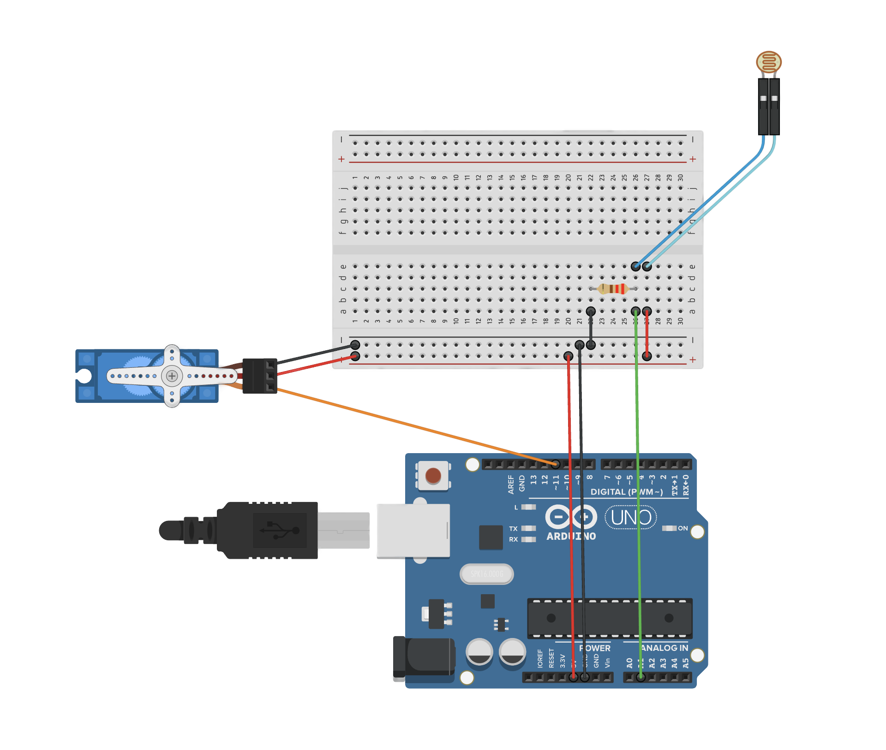

# Arduino Dino Jump

Original designs and code by Kristopher and modified by [theJame](https://github.com/thatJame).

## Table of Contents

1. [Introduction](#introduction)
2. [Materials](#materials)
3. [Device Design](#device)
4. [Experimental Features](#experimental)
5. [Demos](#demos)
6. [More Information](#info)

## 1. Introduction 

This device was first built by an 11 year old in just two hours. After making some modifications we came up with this design.

The program is designed to be simple and easy to use. Depending on device brightness you will need to change variables to detect whether or not it detects a cactus. 

The program **only works on light mode**, but you can probably make it run on dark mode by changing the operator and light level detected.

## 2. Device Design 

This device was designed to be as simple as possible. To build it you will need the following:

 - Arduino Uno
 - Breadboard
 - 180° Servo Motor
 - Photoresistor
 - 220Ω resistor

## 3. Device Design 

The original design used [Inventr Hero boards](https://inventr.io/products/hero-board-usb-cable). You can find the modified device design for [Arduino Uno](https://store-usa.arduino.cc/products/arduino-uno-rev3) (and similar devices) below:

## 4. Experimental Features 

This entire project is experimental for the time being, so all updates will add any experimental features we've been working on.

## 5. Demos 

You can take a look at the very first demo [here](https://x.com/theJame_/status/1786889613354868870).

You can find the tinkercad simulation [here](https://www.tinkercad.com/things/8ZH1Ud4pSPo-dinodevice).

## 6. More Information 

You can find the tinkercad simulation [here](https://www.tinkercad.com/things/8ZH1Ud4pSPo-dinodevice).

For any questions or support, please contact [theJame](https://x.com/theJame_).

---

We hope this documentation provides a clear understanding of the device and its capabilities. If you have any further questions or need additional information, please don't hesitate to reach out.

Have fun building!
 
 
